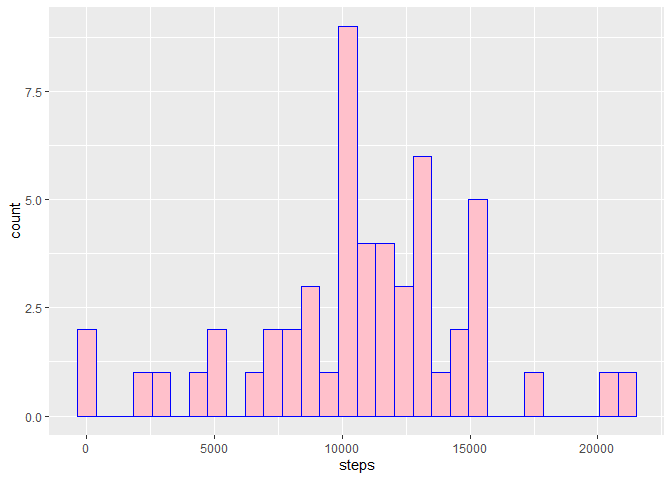
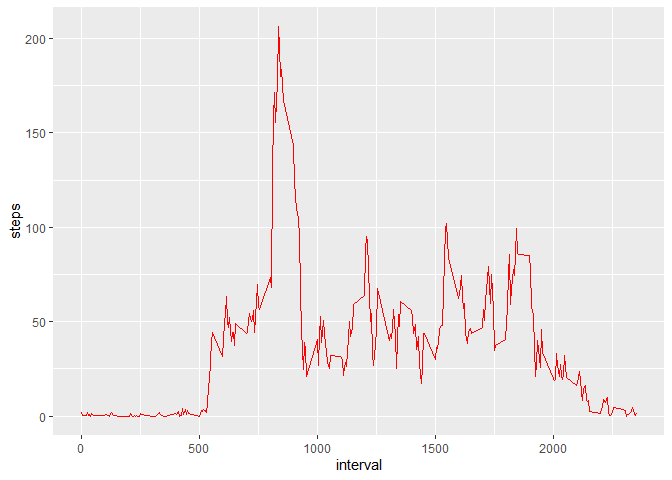
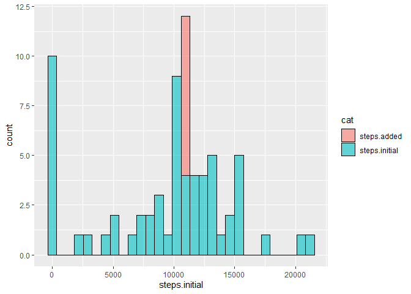
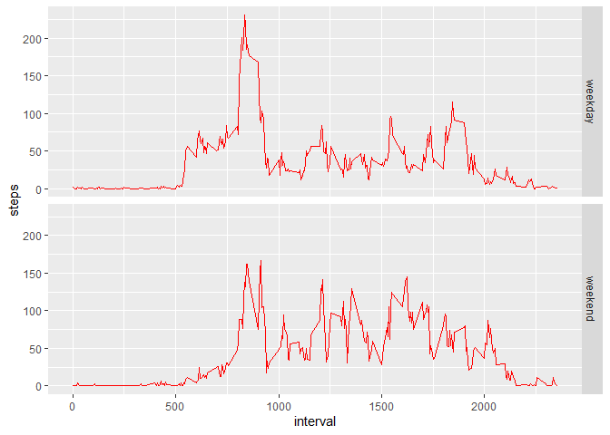

## Loading and preprocessing the data

Set the working directory to 'RepData_PeerAssessment1' containing files of the project, then read the CSV file.


```r
data <- read.csv(unzip("activity.zip"))
```


## What is mean total number of steps taken per day?

*Make a histogram of the total number of steps taken each day*


```r
daily <- aggregate(steps ~ date, data, sum)
ggplot(daily, aes(steps)) + geom_histogram(color = "blue", fill = "pink", bins = 30)
```

<!-- -->

*Calculate and report the mean and median total number of steps taken per day*

```r
meanst <- mean(daily$steps)
medianst <- median(daily$steps)
```
So the mean for the dataset is 10766.19, and the median is 10765

## What is the average daily activity pattern?
*Make a time series plot (i.e. type = "l") of the 5-minute interval (x-axis) and the average number of steps taken, averaged across all days (y-axis)*


```r
by.int <- aggregate(steps ~ interval, data, mean)
ggplot(by.int, aes(interval, steps)) + geom_line(color = "red")
```

<!-- -->


*Which 5-minute interval, on average across all the days in the dataset, contains the maximum number of steps?*

```r
by.int$interval[which.max(by.int$steps)]
```

```
## [1] 835
```

## Imputing missing values

*Calculate and report the total number of missing values in the dataset*


```r
nrow(data[is.na(data$steps),])
```

```
## [1] 2304
```

*Devise a strategy for filling in all of the missing values in the dataset.*

**Selected NA-filling strategy**: let all NAs be equal to the mean of a corresponding interval accross all days

*Create a new dataset that is equal to the original dataset but with the missing data filled in.*


```r
data.imp <- transform(data, steps = ifelse(is.na(data$steps), by.int$steps[match(data$interval, by.int$interval)], data$steps))
```

*Make a histogram of the total number of steps taken each day and Calculate and report the mean and median total number of steps taken per day. Do these values differ from the estimates from the first part of the assignment? What is the data.impact of data.imputing missing data on the estimates of the total daily number of step*


```r
daily.imp <- aggregate(steps ~ date, data.imp, sum)
# merge original aggregate with imputed one to create a full dataset
dda <- merge(daily, daily.imp, by = "date", all.y = T)
# set missing values (of the original data) to 0
dda[is.na(dda$steps.x), "steps.x"] <- 0
# calculate the difference between original and imputed data for each day
dda2 <- mutate(dda, steps.added = steps.y - steps.x, steps.initial = steps.x)
# remove all the 0 values from the calculated difference so that the graph won't be skewed 
dda2$steps.added[dda2$steps.added == 0] <- NA
# melt the table leaving only values for original number of steps and calculated data.impute
dda3 <- gather(dda2, cat, steps.initial, -date, -steps.y, -steps.x)
ggplot(dda3, aes(x = steps.initial, fill = cat)) + geom_histogram(position = "stack",  bins = 30, alpha = 0.6, color = "black")
```

<!-- -->

The values, of course, differ from what we had originally: there are whole 8 days of missing values, with each day corresponding to a little over 10,000 steps. Adding them back changes the data, but at this level of precision it is hard to tell if that makes a lot of difference or not.


```r
meanst1 <- mean(daily.imp$steps)
medianst1 <- median(daily.imp$steps)
meanst1
```

```
## [1] 10766.19
```

```r
medianst1
```

```
## [1] 10766.19
```

As the data shows,  should we replace missing values in the dataset with mean values for corresponding interval, the overall mean does not change. And because the dataset acqures a number of values that are exactly equal to the mean, the median also becomes equal to the mean.

## Are there differences in activity patterns between weekdays and weekends?

*Create a new factor variable in the dataset with two levels – “weekday” and “weekend” indicating whether a given date is a weekday or weekend day.*


```r
data.imp$wday <- as.POSIXlt(data.imp$date)$wday
data.imp$dayend <- as.factor(ifelse(data.imp$wday == 6 | data.imp$wday == 0, "weekend", "weekday"))
```


*Make a panel plot containing a time series plot (i.e. type = "l") of the 5-minute interval (x-axis) and the average number of steps taken, averaged across all weekday days or weekend days (y-axis).*


```r
daily3 <- aggregate(steps ~ interval + dayend, data.imp, mean)
ggplot(daily3, aes(interval, steps)) + geom_line(color = "red") + facet_grid(rows = daily3$dayend)
```

<!-- -->
As we can see the weekday/weekend patters are different, but we would need to dig deeper into the data to figure out if that actually means anything.
